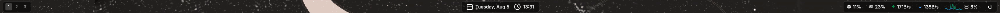

# Skadi 🧊

Skadi is a web-powered widget system, it is powered by webkit6 and gtk, making it extremely customizable by using web techologies and frameworks like React, Svelte, Vue, etc.

## Note

This is still in very early development.
Currently only React is supported.

## If you're concerned about resources

Keep in mind that since it is powered by webkit6, this will be pretty memory intensive, and it WILL take a lot of ram. (on my system: arch x86_64 32gb takes up about 200MB of ram), So if that's a concern, please consider something else like [eww](https://github.com/elkowar/eww).

I think that the tradeoff between resource usage and customizability is worth, that's why I made this.

## Installation

To install skadi, if you can just grab the precompiled binary for x86_64 in the releases. Otherwise you can compile it yourself, but it requires cargo and rust.

To compile it, just clone the repo
and put the binary in $PATH.

```
git clone https://github.com/saverioscagnoli/skadi.git
cd skadi
cargo build --release
sudo cp ./target/release/skadi /usr/bin
```

## Usage

This is basically an automated vite project managed by a cli and ad webkit6 app to display them.

You can execute scripts and programs with `exec`, and listen to events with `useLisen`. (See [utils.js](./templates/utils.js))

For events to be picked up by `useListen` you need to put the script's full path as the event name, and the script must print json output to stdout, that will be parsed and passed to the callback.

For polling scripts, like system monitoring, when calling `exec`, the `polls` flag must be set to true; like this:

```js
exec({ script: "script-name", polls: true });
```

and then you can use

```ts
useListen<T>("script-name", (data: T) => {});
```

## Configuration

You have to use the configuration placed at ~/.config/skadi/config(.json,.jsonc,.json5,.toml,.yaml)

This is an example:

```json
{
  "windows": [
    {
      "label": "topbar",
      "monitor": "DP-1",
      "x": 0,
      "y": 4,
      "width": "99.5%",
      "height": "40",
      "anchor": "top center",
      "exclusive": true,
      "plugins": ["./plugins/topbar.tsx"],
      "styles": ["./styles/style.css"]
    }
  ]
}
```

You can look at properties in [source](./common/src/config.rs)

### Cli args

- `--skip-requirements`: Skips checking for requirements like nodejs and npm
- `--skip-vite`: Skips building the vite project, this will save up a lot of time, but use it only if you've already built it previously.
- `--dev`: Spins up the vite dev server, so you can edit plugins and it will display the changes immediately!
- `--debug`: Enables debug logging and web inspector.
- `--workspace-dir`: Path to the managed vite workspace. The default path is `~/.local/share/skadi`.
- `--show-ouput`: Shows the output of `vite build` and `vite dev` in the terminal.

## Dependencies

- [webkit](https://webkit.org/) (more specifically the rust crate [webkit6](https://docs.rs/webkit6/latest/webkit6/))
- [nodejs](https://nodejs.org)
- [npm](https://www.npmjs.com/)

Nodejs and npm will be automatically detected at the start of the program if not using `--skip-requirements`

## Examples

My personal topbar


You can look in the [examples/topbar](./examples/topbar/) directory for it.

Keep in mind you need to edit the path to the script files.

You can contribute some examples if you'd like!

## License

MIT License (c) 2025 Saverio Scagnoli
